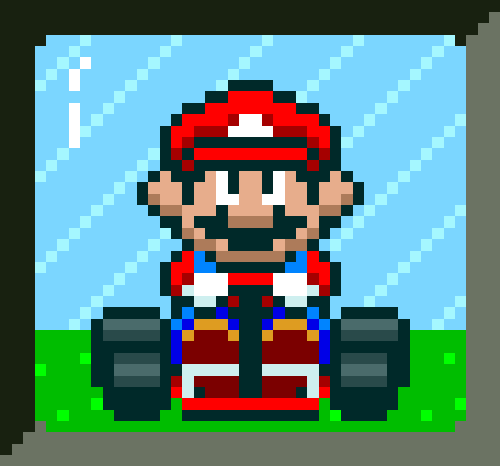

<h1>🏎️ Mario Kart.JS - Corrida entre Mario e Luigi</h1> <table> <tr> <td>  </td> <td> <b>Objetivo:</b> 
Este projeto é uma simulação de corrida inspirada em Mario Kart, desenvolvida com JavaScript puro (Node.js). O desafio foi criar uma engine de corrida entre dois personagens, aplicando conceitos de lógica de programação, randomização e controle de fluxo.
 </td> </tr> </table>
🎮 Como funciona a corrida?
Nesta versão da corrida, temos dois personagens fixos: Mario e Luigi.

Mario:
Velocidade: 4 | Manobrabilidade: 3 | Poder: 3

Luigi:
Velocidade: 3 | Manobrabilidade: 4 | Poder: 4

A corrida acontece ao longo de 5 rodadas, e a cada rodada um tipo de trecho da pista é sorteado.

🛣️ Tipos de blocos da pista:
Bloco	Regras
RETA	Cada jogador rola um dado de 6 lados e soma o resultado com sua VELOCIDADE. Quem tiver o maior valor, ganha 1 ponto.
CURVA	Cada jogador rola um dado e soma com sua MANOBRABILIDADE. O vencedor da rodada marca 1 ponto.
CONFRONTO	Ambos jogam o dado e somam com o PODER. Quem vencer, faz o oponente perder 1 ponto (mas os pontos nunca ficam negativos). Em caso de empate, ninguém perde ponto.

📜 Regras gerais:
A corrida sempre terá 5 rodadas.

Nenhum jogador pode ter pontuação negativa.

Ao final, o jogador com mais pontos é declarado o vencedor.

Empates podem acontecer.

▶️ Como executar o projeto:
Pré-requisitos:
Ter o Node.js instalado na sua máquina.

Execução:
Abra o terminal na pasta do projeto e execute:

bash
Copiar
Editar
node index.js
(Assumindo que o nome do arquivo seja index.js - ajuste o comando se estiver usando outro nome.)

👾 Exemplo de saída no console:
yaml
Copiar
Editar
🏁🚨 Corrida entre Mario e LUIGI começando...

🏁 Rodada 1
Bloco: CURVA
Mario 🎲 rolou um dado de manobrabilidade 5 + 3 = 8
LUIGI 🎲 rolou um dado de manobrabilidade 2 + 4 = 6
Mario marcou um ponto!
----------------------------------------------

...

Resultado final:
Mario: 3 ponto(s)
LUIGI: 2 ponto(s)

Mario venceu a corrida! Parabéns! 🏆
✅ Itens do Desafio propostos e implementados:
 Dois personagens como objetos

 Corrida com 5 rodadas

 Sorteio de blocos: reta, curva ou confronto

 Regras específicas para cada bloco

 Controle de pontos sem valor negativo

 Definição de vencedor ao final

🛠️ Tecnologias utilizadas:
JavaScript (Node.js)

Console.log para exibir o fluxo da corrida no terminal

👨‍💻 Autor:
Projeto desenvolvido por Juan como parte do desafio de projeto proposto por Felipão.

